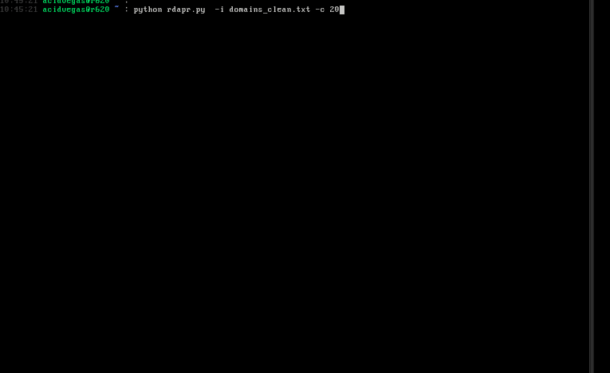

# MassRDAP

## Information
This script will take an input list of domains and retrieve [WHOIS](https://en.wikipedia.org/wiki/WHOIS) information for them using the [Registration Data Access Protocol](https://en.wikipedia.org/wiki/Registration_Data_Access_Protocol) *(RDAP)*. Depending on the TLD the domain is under will determine which RDAP server the request is made on. We are using the [Bootstrap Service Registry for Domain Name Space](https://www.iana.org/assignments/rdap-dns/rdap-dns.xhtml) from [IANA](https://www.iana.org/).

###### This is a work in progress still *(stay tuned)*

## Rate Limiting
From my experience, it seems every RDAP server has their employed rate limits. While I am still benchmarking and testing these limits, proxy support has been added to circumvent this issue.

## Usage
| Argument              | Description                                                           | Default Value |
|-----------------------|-----------------------------------------------------------------------|---------------|
| `-i`, `--input_file`  | File containing list of domains (one per line).                       |               |
| `-p`, `--proxy`       | Proxy in `user:pass@host:port` format. If not supplied, none is used. |               |
| `-c`, `--concurrency` | Number of concurrent requests to make.                                | 25            |
| `-o`, `--output`      | Output file to write successful RDAP data to.                         | `output.json` |
| `-f`, `--failed`      | Output file to write failed domains to. (optional)                    | `failed.txt`  |

## WHOIS & RDAP Statistics

By comparing the [root TLDS](https://data.iana.org/TLD/tlds-alpha-by-domain.txt) and the [RDAP Bootstrap](https://data.iana.org/rdap/dns.json) data from IANA, along with querying IANA's [WHOIS](https://www.iana.org/whois) server to find other TLD's WHOIS servers, we can formulate coverage statistics on WHOIS/RDAP availability across all available TLDS:

###### RDAP
| Status  | Results       |
| ------- | ------------- |
| RDAP    | 1,174 *(81%)* |
| No RDAP |   275 *(19%)* |

###### WHOIS
| Status   | Results       |
| -------- | ------------- |
| WHOIS    | 1,253 *(86%)* |
| No WHOIS |   196 *(14%)* |

## Roadmap
- Explore other RDAP servers from RIRs, registrars, IANA *(see [here](https://data.iana.org/rdap/))*
- Mass domain availability lookups
- Find available 1 or 2 letter domains.

___

###### Mirrors for this repository: [acid.vegas](https://git.acid.vegas/massrdap) • [SuperNETs](https://git.supernets.org/acidvegas/massrdap) • [GitHub](https://github.com/acidvegas/massrdap) • [GitLab](https://gitlab.com/acidvegas/massrdap) • [Codeberg](https://codeberg.org/acidvegas/massrdap)